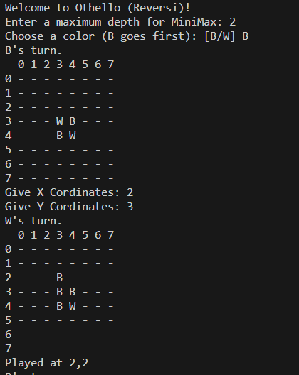

Othello (Reversi)
=================

1st assignment - Artificial Intelligence 2023-24 @ [AUEB](https://aueb.gr).

Goal
----
Implement the board game Othello (also known as Reversi). It supports two
players:

* Computer:
  * uses the [MiniMax algorithm](https://en.wikipedia.org/wiki/Minimax) to
    choose the optimal next move based on a heuristic.
  * It's max depth is determined by the user.
* User:
  * can choose to go first.
  * Determines the computer's max depth at the beginning of the game (a bit
    like choosing the difficulty in other games).

Read more here:

* [Assingment Paper](ai_assignment1_description.pdf) (lang: GR)
* [Our report](report.pdf) (lang: GR)
* [Reversi rules](https://en.wikipedia.org/wiki/Reversi#Rules)

Known Bugs
----------
* During the user's turn, we only check if the input can be interpreted as an
  integer value with `Scanner.nextInt()`. So if the input contains non-digit
  characters, the game will throw an `InputMismatchException` and terminate.
* During the computers turn, while evaluating the optimal next board state, the
  algorithm doesn't consider whether it has to pass that turn or not. This can
  lead to a rare bug, where the computer chooses a move that is optimal in
  theory, but out of bounds in practice. The game throws an
  `IndexOutOfBoundsException` and terminates.

